  

 

<h1 align="center"> 🤝 Socials: </h1>
  

    
     
    
  

</h1>

<h4 align="center"> The widgets on my <code>README.md</code> are works of many other contributers. Click on the widgets to use them yourself. </h4>

<a href="https://github.com/ESKYoung/shields-io-visitor-counter">
  
<a>

